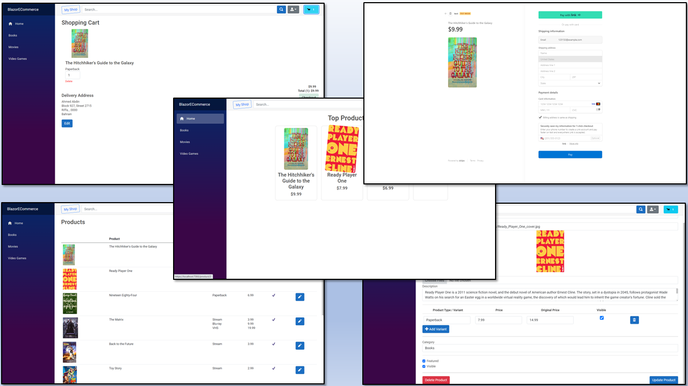

# Blazor-ECommerce

Blazor-ECommerce is an E-Commerce website built using .NET framework, specifically Blazor pages. It provides a solution for managing store products and making them available online for customers to purchase. The website includes two roles: Admin and user/customer, and integrates with Stripe for payment processing.

## Problem

The primary problem addressed by Blazor-ECommerce is the need to efficiently manage store products and offer them for online purchase. Traditional methods of manual inventory management and brick-and-mortar stores can be time-consuming and limit the potential customer base. By creating an E-Commerce website, businesses can reach a wider audience and streamline the process of product management and sales.

## Solution

Blazor-ECommerce offers a comprehensive solution for building an E-Commerce website. It leverages the power of .NET framework and utilizes Blazor pages as the primary technology for developing the user interface. The website incorporates two user roles: Admin and user/customer.

Administrators have access to features such as managing product inventory, setting prices, updating product information, and monitoring sales. Users/customers can browse products, add them to the cart, and proceed with the checkout process.

Stripe, a popular payment gateway, is integrated into the website to handle secure and seamless payment transactions. This ensures that customers can safely make purchases using various payment methods supported by Stripe.

## Environment and Tools

Blazor-ECommerce is developed using the following environment and tools:

- Visual Studio 2022: The latest version of Microsoft's integrated development environment (IDE), providing a rich set of tools for building .NET applications.
- SQL Server 2022: A robust relational database management system (RDBMS) used to store and manage product data.
- SQL Server Management Studio (SSMS) 19.1: A graphical tool for managing SQL Server databases, used for tasks such as querying and database administration.

## Tools and Techniques

Blazor-ECommerce incorporates the following tools and techniques:

- Blazor pages: A web UI framework for building interactive client-side applications using .NET.
- Bootstrap: A popular CSS framework for creating responsive and visually appealing web pages.
- Swagger UI: A tool for automatically generating interactive API documentation, making it easier to explore and test the RESTful API.
- Entity Framework: An object-relational mapping (ORM) framework that simplifies database access and manipulation in .NET applications.

The following techniques are utilized in the development of Blazor-ECommerce:

- RESTful API: The website follows the principles of Representational State Transfer (REST) for designing its API endpoints, enabling interoperability and scalability.
- CRUD Operations: The application supports Create, Read, Update, and Delete operations for managing product inventory and user information.
- Service Design Pattern: The application architecture follows the Service design pattern, which promotes loose coupling and separation of concerns.
- JWT (JSON Web Token): JSON Web Tokens are used for authentication and authorization, ensuring secure access to protected resources.

## Course

This project was developed following the course titled "Blazor-ECommerce" on Udemy. The course provides comprehensive guidance and hands-on exercises for building an E-Commerce website using Blazor and .NET framework. You can find the course [here](https://www.udemy.com/course/blazor-ecommerce/).

## Getting Started

To get started with Blazor-ECommerce, follow these steps:

1. Clone the repository: `git clone https://github.com/your-username/Blazor-ECommerce.git`
2. Open the solution in Visual Studio 2022.
3. Restore the NuGet packages.
4. Set up the SQL Server database using the provided SQL scripts or migrations.
5. Configure the Stripe payment gateway with your API keys.
6. Build and run the application.

## Contributing

Contributions to Blazor-ECommerce are welcome! If you encounter any bugs or have suggestions for improvements, please open an issue on the GitHub repository. You can also submit pull requests for new features or bug fixes.

Before contributing, please review the contribution guidelines to ensure a smooth collaboration process.

## License

Blazor-ECommerce is open-source software released under the [MIT License](https://opensource.org/licenses/MIT). You are free to use, modify, and distribute the codebase in accordance with the terms of the license.

## Acknowledgments

We would like to acknowledge the following resources and libraries that have been instrumental in the development of Blazor-ECommerce:

- Blazor documentation: [https://docs.microsoft.com/en-us/aspnet/core/blazor](https://docs.microsoft.com/en-us/aspnet/core/blazor)
- Bootstrap documentation: [https://getbootstrap.com/docs](https://getbootstrap.com/docs)
- Stripe documentation: [https://stripe.com/docs](https://stripe.com/docs)
- Entity Framework documentation: [https://docs.microsoft.com/en-us/ef](https://docs.microsoft.com/en-us/ef)
- JWT documentation: [https://jwt.io/introduction](https://jwt.io/introduction)

# Post 

Exciting News! I'm thrilled to introduce my latest project (https://github.com/A7medAbdien/BlazorECommerce), an E-Commerce website developed with .NET, SQL Server 2022, and SSMS (SQL Server Management Studio) 19.1. This project is inspired by my previous successful venture, ProShop, but with a twist. The website incorporates the powerful capabilities of .NET and SQL Server to deliver a robust and scalable platform for online shopping.

One of the key highlights of this project is the integration of Stripe as the payment gateway, ensuring secure and seamless transactions for customers. Additionally, I have implemented a server-side cart storage mechanism, providing a convenient and reliable shopping experience.

Building upon the foundation of ProShop, I have leveraged the flexibility and performance of .NET and SQL Server to create a tailor-made E-Commerce solution.

#ECommerce #DotNet #SQLServer #SSMS #StripePayment #ServerSideCart #OnlineShopping #WebDevelopment